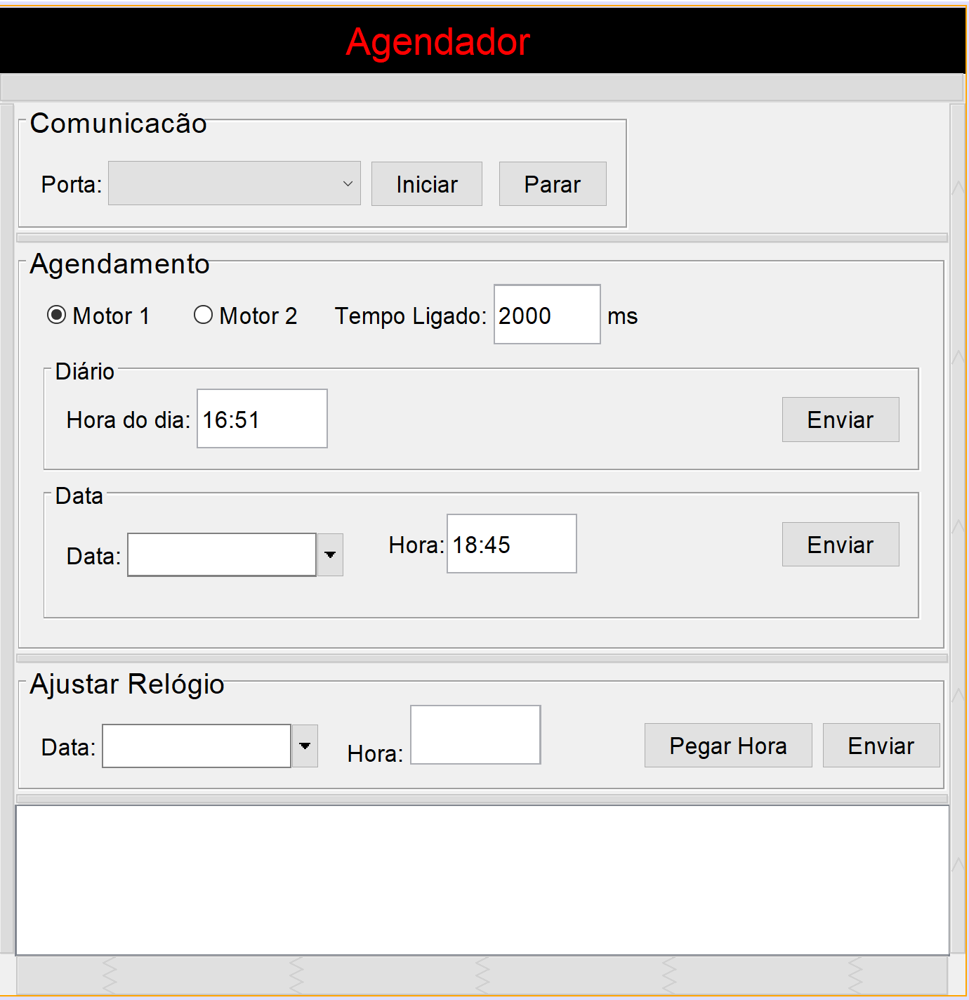

# Agendador

Graphic interface that works along with [Scheduler](https://github.com/aleaugustoplus/scheduler) which is a system that controls electric motors in order to execute and automate tasks both software comunicate via serial port

## Getting Started

Run the command  below to start the software
```java -jar "dist\Agendador.jar"```

### Prerequisites

Requires JAVA 1.6 or higher does not require installation 
Requires rxtxSerial java library installed 
It works on Linux, Windows or MAC

```
Give examples
```
## Screenshots



### Installing

It requires 

## Running the tests

Automated tests have not been used 

## Deployment

It requires the hardware equipment to be installed in order to be fully functional

## Built With

* [Maven](https://maven.apache.org/) - Dependency Management

## Contributing

Please stay free to submit pull requests at any time

## Authors

* **Alexandre Lopes** - *Initial work* - [Alexandre Lopes](https//alexandre-lopes.com)


## License

This project is licensed under the MIT License - see the [LICENSE](https://en.wikipedia.org/wiki/MIT_License) page for details

## Acknowledgments

* Some third party open source libraries have been used thank you for that


https://aprendizadodemaquina.com
